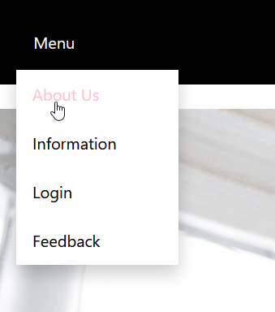
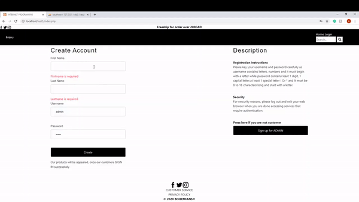
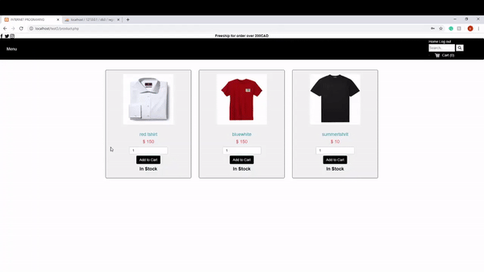
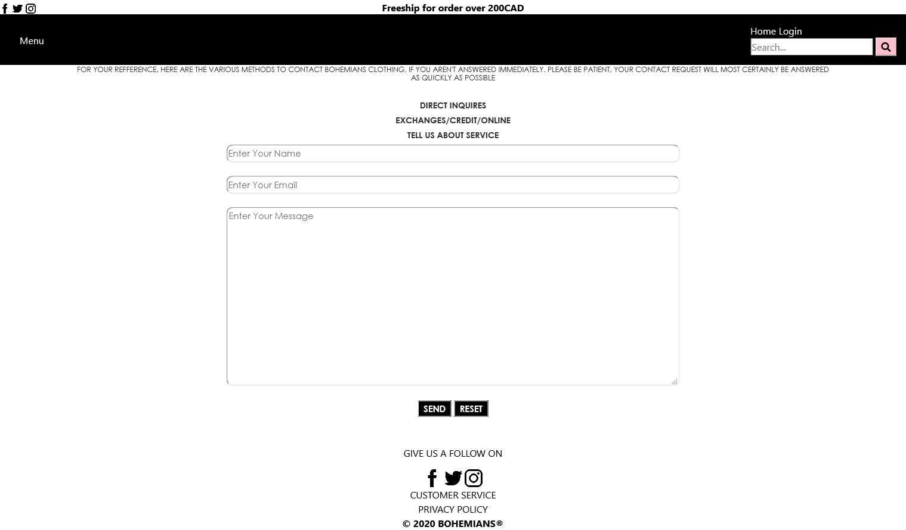

# Bohemians - A school project building an apparel website 

## Description
This website was co-developed in my internet programming class with 3 other students. My main responsibility was configuring the back end database component and work on the login/signup form as well as help with page layout.

## Installation
Download the whole repository and unzip and it is ready to be viewed in a web browser

## Some images and gif of the website
**Bohemians Homepage:**
  

  
**Navigation Menu:**
 User can use this menu to navigate to differents pages of the website
  

**Signup and Login Process:**
 A demonstration of the signup and login page and its validation requirements, a user account is also shown created in the backend database
  

**Shopping cart Customization:**
 Adding and removing products to the cart
  

  
**Bohemians Feedback Form:**
  

  
## DataBase 
The system used to store user informations and products database in this project is phpMyAdmin

## Technologies Used
* Page contents and structures are builded using HTML
* Layout and website's assets are presented using CSS
* Some build-in function like the background carousel are written in JavaScript
