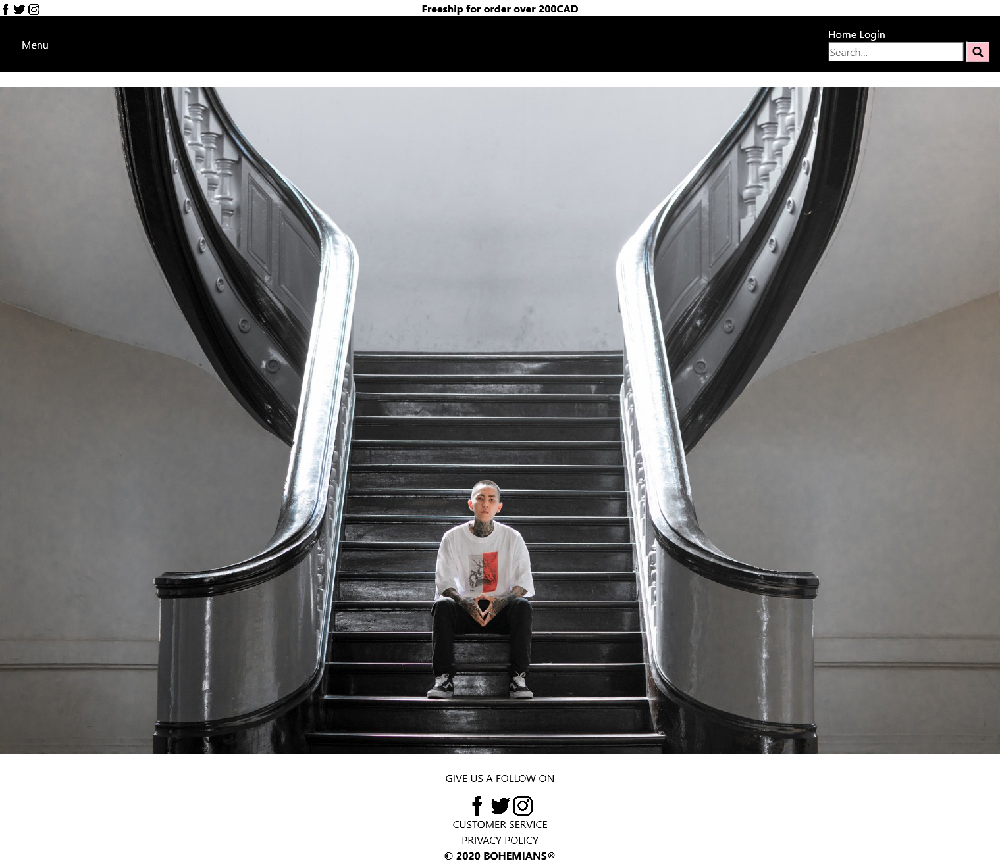

# Bohemians - A school project building an apparel website 

## Description
This website was co-developed in my internet programming class with 3 other students. My main responsibillity was configuring the back end database component and work on the login/signup form as well as help with page layout.

## Installation
Download the whole repository and unzip and it is ready to be viewed in a web browser

## Images
### Bohemians Homepage:
  

### Navigation Menu:
  

### Bohemians Feedback Form:
  

## Technologies Used
* Page contents and structures are builded using HTML
* Layout and website's assets are presented using CSS
* Some build-in function like the background carousel are written in JavaScript
